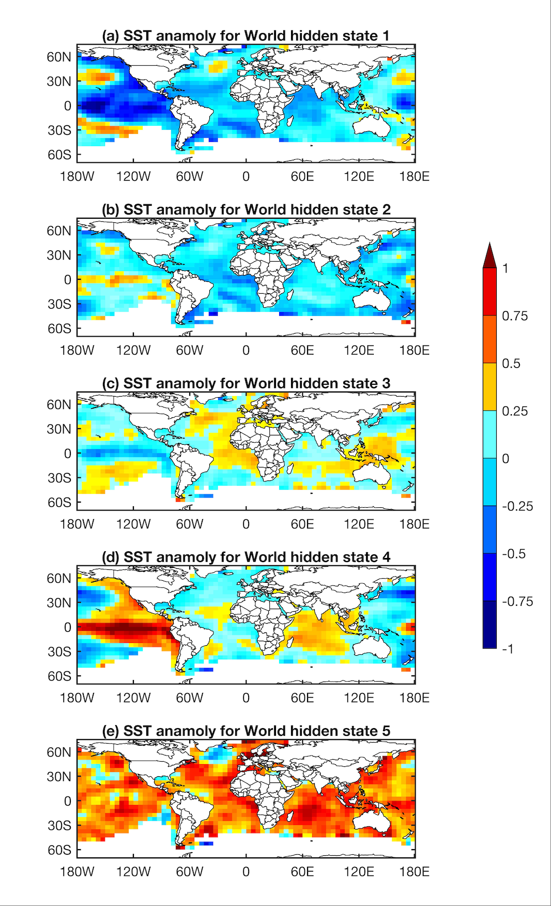

# Time-series-of-SST-hidden-states
## Time series data 
Time series of hidden states for Pacific Ocean, simulated by Non-homogenous Hidden Markov Model for Pacific Ocean (NHMM_P)

  - Hidden_state_time_series_Pacific_SST.xlsx

Time series of hidden states for Global Oceans, which is jointly simulated by NHMM for sea surface temperature of Pacific, Atlantic and Indian Oceans (NHMM_G).

  - Hidden_state_time_series_Global_SST.xlsx

## Spatial pattern of different hidden states

### Spatial Patterns of the identified five Pacific ENSO-like states by NHMM_P

### Spatial Patterns of the identified five Global ENSO-like states by NHMM_G

## Model cofigurations
- NHMM_P simulate the dynamics of SST in the Tropical Pacific Ocean, with the transition probability among hidden states varying with seasonality terms, and smoothed global temperature.
- NHMM_G simulate the dynamics of SST in the Tropical Pacific, Atlantic and Indian Oceans, with the transition probability among hidden states varying with only seasonality terms.
